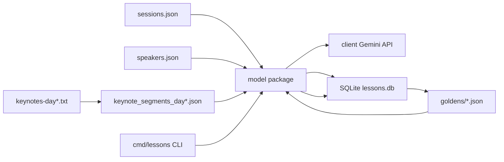
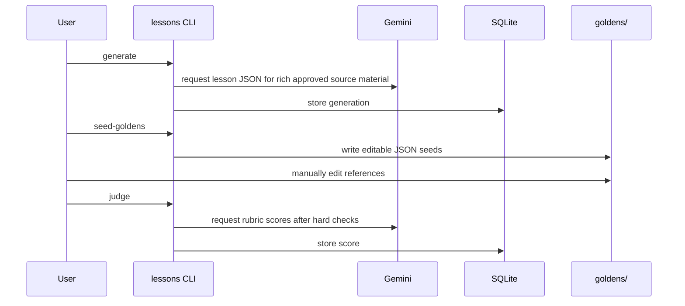

# Architecture

This is a Vite + React + TypeScript single-page app. It has no backend service: all schedule records are embedded in the frontend bundle, and user-specific state is stored in the browser.

## Runtime Shape

The app uses a small MVC-style split:

- Models: pure data and domain helpers in `app/src/models`.
- Controllers: React hooks in `app/src/controllers`.
- View: the top-level app shell in `app/src/views`.
- Components: reusable UI pieces in `app/src/components`.

At runtime, `app/src/main.tsx` mounts `App` from `app/src/views/App.tsx`. `App` creates two controller hooks:

- `useSchedule()` loads the embedded schedule, tracks search/filter state, and returns grouped time slots.
- `useFavorites()` loads saved session ids from `localStorage`, updates them when the user stars or unstars a session, and exposes the saved count.

`App` then renders either the full schedule tab or the "My Schedule" tab.

## Data Flow

1. `app/src/models/scheduleData.ts` exports `scheduleSessions`, `DAY_LABEL`, `DAY_DATE`, and `VENUE`. It also attaches optional video URLs from `app/src/data/session-video-links.json`.
2. `app/src/models/session.ts` exports helpers over that data:
   - `matchesQuery`
   - `applyFilters`
   - `sortSessionsByTime`
   - `groupByTimeSlot`
   - `sessionsOverlap`
   - `findConflicts`
   - `conflictingIds`
3. `app/src/controllers/useSchedule.ts` stores the active query, track filters, and type filters.
4. `app/src/views/App.tsx` passes the derived time slots to `SessionList`.
5. `SessionList` renders one `TimeGroup` per start time.
6. `TimeGroup` renders a `SessionCard` for each session.

The search box is intentionally broad: query matching checks session title, track, description, speaker name, and speaker role.

## Favorites and Conflicts

Favorites are stored as session ids under the `aiewf.day2.favorites` key in browser `localStorage`.

The saved-session path is:

- `app/src/components/SessionCard.tsx`: star button toggles a session id.
- `app/src/controllers/useFavorites.ts`: updates the selected id list.
- `app/src/models/favorites.ts`: persists the list in `localStorage`.
- `app/src/components/MySchedule.tsx`: maps ids back to schedule records, sorts them, groups them by time, and computes conflicts.
- `app/src/models/session.ts`: `conflictingIds` identifies overlapping saved sessions.
- `app/src/components/ConflictNotice.tsx` and `SessionCard.tsx`: display conflict warnings.

## Where "Interactive Loops" Lives

There is no separate `interactive-loops` feature module in this app. The relevant content lives in the embedded schedule data and is surfaced through the normal search flow.

Search for `thinking in loops` or `loops` in `app/src/models/scheduleData.ts`. The clearest entries are:

- `d2-134`: "Setting Yourself Up for Success - Part 1", 2:50pm-3:10pm, `Workshops Day 2 - Track 4`.
- `d2-149`: "Setting Yourself Up for Success - Part 2", 3:20pm-3:40pm, `Workshops Day 2 - Track 4`.
- `d2-160`: "Setting Yourself Up for Success - Part 3", 3:45pm-4:05pm, `Workshops Day 2 - Track 4`.

Those entries mention preparing yourself to start "thinking in loops". Because `matchesQuery` searches descriptions, typing `loops` in the app search box will find these sessions.

If this becomes an actual product feature later, the likely implementation path would be:

- Add metadata or tags to `ScheduleSession` in `app/src/models/scheduleData.ts`.
- Extend filtering/search helpers in `app/src/models/session.ts`.
- Expose the new filter state in `app/src/controllers/useSchedule.ts`.
- Add a filter control in `app/src/views/App.tsx` or `app/src/components`.

## Tests

Tests are colocated next to the relevant code:

- Model behavior: `app/src/models/*.test.ts`.
- Controller hooks: `app/src/controllers/*.test.ts`.
- UI rendering and interactions: `app/src/components/*.test.tsx` and `app/src/views/*.test.tsx`.

Run them with:

```bash
cd app
npm test
```

## Lessons Learned CLI

The root Go module implements a crawl-stage lesson generator and judge. It is intentionally separate from the frontend and treats `app/src/data/sessions.json`, `app/src/data/speakers.json`, and `app/src/data/keynotes-day*.txt` as read-only inputs.



The package split is:

- `cmd/lessons`: command parsing and orchestration for `generate`, `seed-goldens`, `judge`, and `run`.
- `model`: schedule adaptation, prompt rendering, lesson schema, thin-description handling, hard checks, generator orchestration, and judge orchestration.
- `client`: Gemini API wrapper using `google.golang.org/genai`.
- `storage`: SQLite persistence using `modernc.org/sqlite`.
- `scripts/build_keynote_segments.mjs`: reproducible extraction of keynote transcript segments from the day-specific raw transcripts into `app/src/data/keynote_segments_day*.json` and consolidated `app/src/data/session-video-links.json`.

The CLI derives stable session ids when the schedule file does not provide one. It joins speaker title/company metadata from the speaker catalog by name, attaches optional transcript segments by session id, but it does not mutate the schedule, speaker, or raw transcript source files.

The schedule app consumes the app-local video-link map by computing the same stable source session id for each raw session. `SessionDetail` renders a "Watch video" link only when `videoUrl` is present.

The first-pass user journey is:


