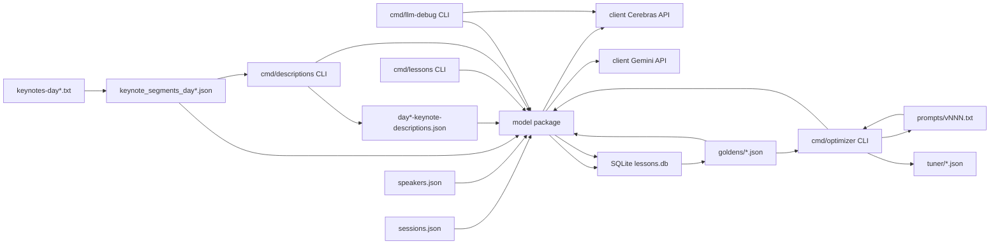
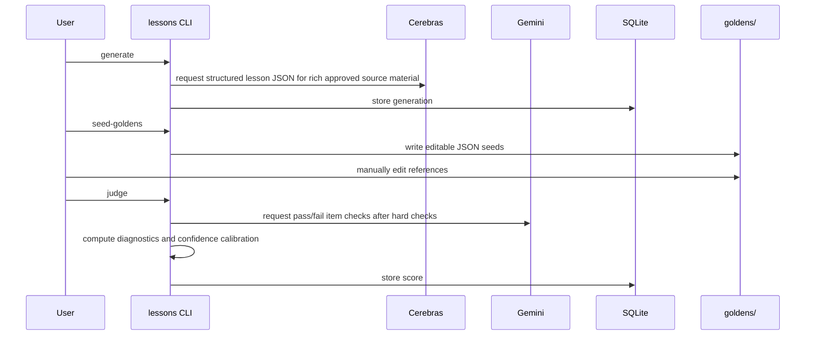
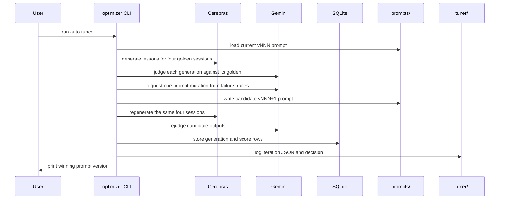
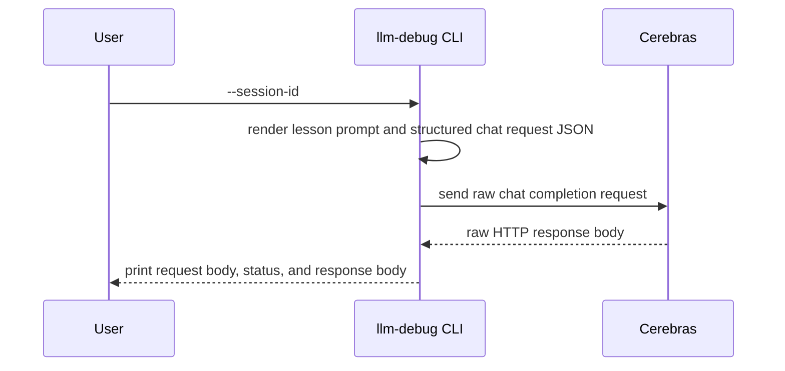

# Architecture

This is a Vite + React + TypeScript single-page app. It has no backend service: all schedule records are embedded in the frontend bundle, and user-specific state is stored in the browser.

## Runtime Shape

The app uses a small MVC-style split:

- Models: pure data and domain helpers in `app/src/models`.
- Controllers: React hooks in `app/src/controllers`.
- View: the top-level app shell in `app/src/views`.
- Components: reusable UI pieces in `app/src/components`.

At runtime, `app/src/main.tsx` mounts `App` from `app/src/views/App.tsx`. `App` creates two controller hooks:

- `useSchedule()` loads the embedded schedule, tracks search/filter state, and returns grouped time slots.
- `useFavorites()` loads saved session ids from `localStorage`, updates them when the user stars or unstars a session, and exposes the saved count.

`App` then renders either the full schedule tab or the "My Schedule" tab.

The shell also includes attribution links: the app title links to the official AI Engineer World's Fair 2026 page, and the footer credits John Pfeiffer with a LinkedIn link.

## Data Flow

1. `app/src/models/scheduleData.ts` exports `scheduleSessions`, `DAY_LABEL`, `DAY_DATE`, and `VENUE`. It also attaches optional video URLs from `app/src/data/video-links-for-sessions.json`.
2. `app/src/models/session.ts` exports helpers over that data:
   - `matchesQuery`
   - `applyFilters`
   - `sortSessionsByTime`
   - `groupByTimeSlot`
   - `sessionsOverlap`
   - `findConflicts`
   - `conflictingIds`
3. `app/src/controllers/useSchedule.ts` stores the active query, track filters, and type filters.
4. `app/src/views/App.tsx` passes the derived time slots to `SessionList`.
5. `SessionList` renders one `TimeGroup` per start time.
6. `TimeGroup` renders a `SessionCard` for each session.

The search box is intentionally broad: query matching checks session title, track, description, speaker name, and speaker role.

On desktop, the schedule uses a master/detail grid where the selected-session detail pane takes roughly two fifths of the available width. The layout collapses to one column on small screens.

`app/index.html` declares Open Graph and Twitter card metadata for `https://feneky.com/aiewf`. The share-card image is `app/public/og-image.png`, generated from `scripts/generate_og_image.mjs`.

## Favorites and Conflicts

Favorites are stored as session ids under the `aiewf.day2.favorites` key in browser `localStorage`.

The saved-session path is:

- `app/src/components/SessionCard.tsx`: star button toggles a session id.
- `app/src/controllers/useFavorites.ts`: updates the selected id list.
- `app/src/models/favorites.ts`: persists the list in `localStorage`.
- `app/src/components/MySchedule.tsx`: maps ids back to schedule records, sorts them, groups them by time, and computes conflicts.
- `app/src/models/session.ts`: `conflictingIds` identifies overlapping saved sessions.
- `app/src/components/ConflictNotice.tsx` and `SessionCard.tsx`: display conflict warnings.

## Where "Interactive Loops" Lives

There is no separate `interactive-loops` feature module in this app. The relevant content lives in the embedded schedule data and is surfaced through the normal search flow.

Search for `thinking in loops` or `loops` in `app/src/models/scheduleData.ts`. The clearest entries are:

- `d2-134`: "Setting Yourself Up for Success - Part 1", 2:50pm-3:10pm, `Workshops Day 2 - Track 4`.
- `d2-149`: "Setting Yourself Up for Success - Part 2", 3:20pm-3:40pm, `Workshops Day 2 - Track 4`.
- `d2-160`: "Setting Yourself Up for Success - Part 3", 3:45pm-4:05pm, `Workshops Day 2 - Track 4`.

Those entries mention preparing yourself to start "thinking in loops". Because `matchesQuery` searches descriptions, typing `loops` in the app search box will find these sessions.

If this becomes an actual product feature later, the likely implementation path would be:

- Add metadata or tags to `ScheduleSession` in `app/src/models/scheduleData.ts`.
- Extend filtering/search helpers in `app/src/models/session.ts`.
- Expose the new filter state in `app/src/controllers/useSchedule.ts`.
- Add a filter control in `app/src/views/App.tsx` or `app/src/components`.

## Tests

Tests are colocated next to the relevant code:

- Model behavior: `app/src/models/*.test.ts`.
- Controller hooks: `app/src/controllers/*.test.ts`.
- UI rendering and interactions: `app/src/components/*.test.tsx` and `app/src/views/*.test.tsx`.

Run them with:

```bash
cd app
npm test
```

## Lessons Learned CLI

The root Go module implements a crawl-stage lesson generator and judge. It is intentionally separate from the frontend and treats `app/src/data/sessions.json`, `app/src/data/speakers.json`, and `app/src/data/keynotes-day*.txt` as read-only inputs.



The package split is:

- `cmd/lessons`: command parsing and orchestration for `generate`, `seed-goldens`, `judge`, and `run`.
- `cmd/descriptions`: command parsing and orchestration for distilling schedule descriptions from one `keynote_segments_day*.json` file.
- `cmd/optimizer`: golden-only prompt auto-tuning. It starts from `prompts/v001.txt` by default, evaluates the four golden sessions, asks Gemini 3.5 Flash for exactly one generalizable mutation, writes the next `prompts/vNNN.txt`, re-evaluates, and accepts the candidate only if the mean score improves by at least 0.05 without any individual golden dropping by more than 0.10.
- `cmd/llm-debug`: command parsing and orchestration for a single `--session-id` LLM exchange trace. It uses the same default schedule, speaker, transcript, description, prompt, model, temperature, strict structured-output schema, `reasoning_effort: medium`, and `reasoning_format: parsed` defaults as lesson generation, then prints the raw request and response without SQLite persistence.
- `model`: schedule adaptation, prompt rendering, lesson schema, thin-description handling, hard checks, generator orchestration, judge orchestration, optimizer mutation prompts, failure trace extraction, prompt versioning, and prompt acceptance rules.
- `client`: Cerebras chat-completions wrapper for lesson generation, Gemini wrapper using `google.golang.org/genai` for judging and description generation, and a retained Groq wrapper that is not wired to any CLI.
- `storage`: SQLite persistence using `modernc.org/sqlite`.
- `scripts/reconcile_session_ids.mjs`: reconciles `sessions.json` with authoritative ASN web ids and stores the previous hash id in `source_ids.derived`.
- `scripts/build_keynote_segments.mjs`: reproducible extraction of keynote transcript segments from the day-specific raw transcripts into `app/src/data/keynote_segments_day*.json` and consolidated `app/src/data/video-links-for-sessions.json`.

The CLI uses canonical `session_id` values from the schedule, falling back to deterministic derived ids only for unreconciled records. It joins speaker title, company, and bio metadata from the speaker catalog by name, loads the default transcript segment files and attaches matching transcript segments by session id, applies reviewed description proposals only when the source schedule description is empty or under 50 characters, and skips `Day 1 — Workshop Day` unless `--include-workshops` is set.

The description helper reads one transcript segment file, calls Gemini once per selected session, and emits one reviewable JSON batch with proposed schedule descriptions. It does not write to `sessions.json`; the output is consumed as an augmentation file or manually copied into source data after review.

The judge path passes the source session, optional transcript, generated lesson, and golden reference as separate labeled prompt inputs. Gemini returns pass/fail item checks and fractional scores for faithfulness, coverage, transferability, and actionability. The Go model layer keeps objective tag F1, status match, and normalized evidence-source-match metrics as diagnostics, computes confidence calibration against the golden, and stores the five-dimension fractional mean as `total_score`.

The optimizer path is fully automated but intentionally restricted to goldens. Each iteration logs baseline scores, candidate scores, failure traces, mutation rationale, token usage, and the accept/reject decision under `tuner/`. Candidate prompts are guarded against direct references to golden session ids, titles, or speaker names before evaluation.

The LLM debug helper exists only to inspect the lesson-generation Cerebras exchange for one session id. It rejects every input except `--session-id`, skips SQLite writes, sends the same strict lesson JSON schema and reasoning settings as normal generation, and returns the HTTP status plus the unparsed response body so prompt and provider issues can be diagnosed outside the normal generation and validation flow.

The schedule app consumes the app-local video-link map by canonical `session_id`. `SessionListItem` renders a "Watch video" link beside the schedule-row track/location, and `SessionDetail` renders the same link inline after the displayed track/location when `videoUrl` is present.

The first-pass user journey is:



The optimizer journey is:



The debug journey is:


